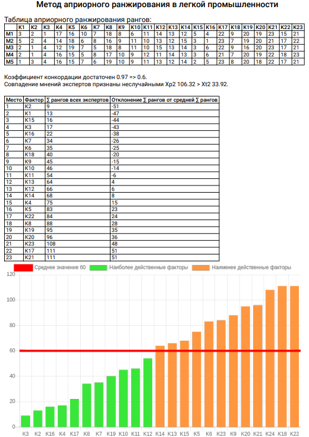

# Метод априорного ранжирования, основанный на экспертной оценке факторов группой специалистов компетентных в исследуемой области.  
Проект находится на стадии прототипирования.  
В проекте используются Vue, pdfmake, vue-chartjs.  
# [Скачать DEMO .html](dist/allInOneUponRequest.html)
# [Скачать DEMO result.pdf](dist/result.pdf)

